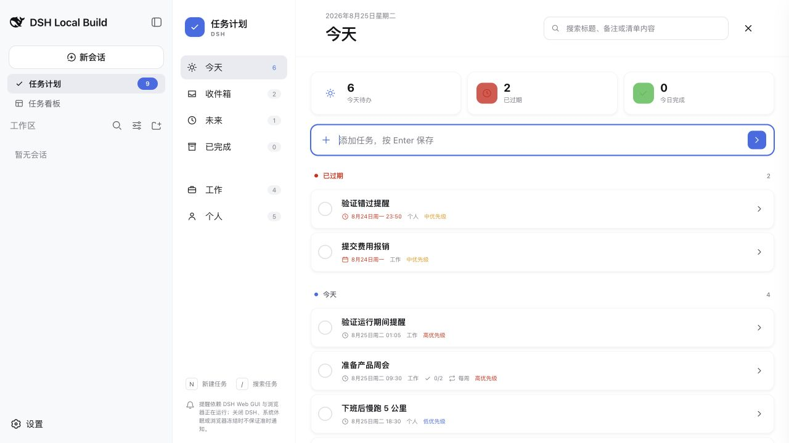
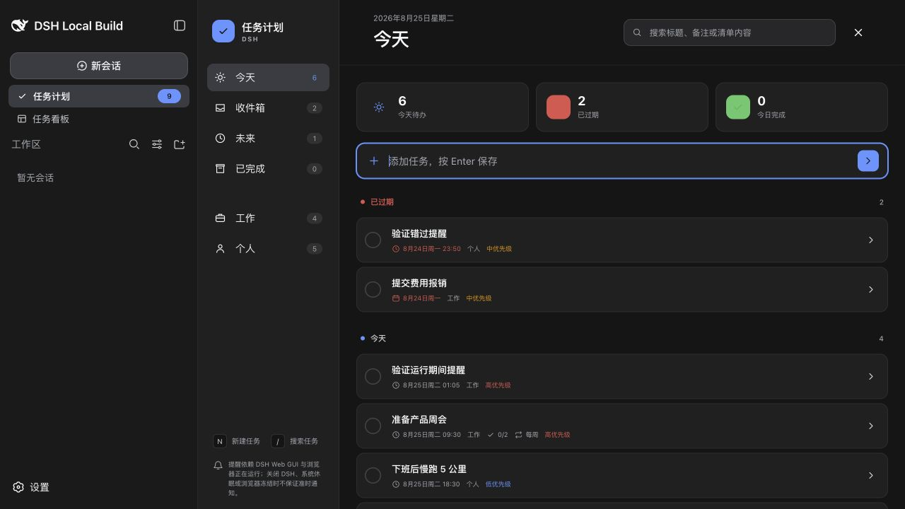
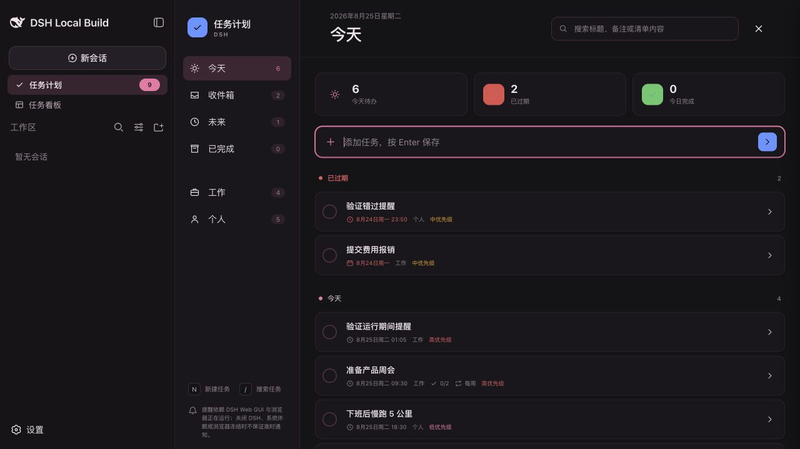

# dsh-task-planner

English | [中文](README.zh.md)

A lightweight daily task planner for the DeepSeek Harness (DSH) Web GUI. It mounts as an independent Cordis bundle through official Client Slots, keeps the Host authoritative, and never modifies DSH source code.

[Project site](https://linxin666.github.io/dsh-task-planner/) | [NPM](https://www.npmjs.com/package/dsh-task-planner) | [Issues](https://github.com/linxin666/dsh-task-planner/issues) | [Privacy](PRIVACY.md)

## Screenshots



| Default dark | Skin Center community skin |
| --- | --- |
|  |  |

The screenshots are captured in the real DSH Web GUI. Component CSS contains no fixed hexadecimal, RGB, or HSL colors; every plugin color comes from official `--dsw-*` semantic variables.

## Features

- Today, Inbox, Upcoming, Completed, Work, and Personal views, with search and schedule-first sorting.
- Fast create, detail editing, delete, complete, restore, and short-lived undo for complete, delete, and reschedule actions.
- Titles, notes, checklist items, priority, date, time, runtime reminders, and daily, weekly, or monthly repeats.
- Today combines overdue and due-today work while keeping overdue items visibly separated.
- Runtime, missed, and remind-later notifications use a Host-side claim so multiple tabs do not all notify the same task.
- Host-authoritative JSON ledger with revision fencing, request idempotency, SSE synchronization, atomic writes, corrupt-file quarantine, and backup-before-restore.
- Constrained Agent tools for create, query, update, complete, restore, and delete. Same-name tasks require disambiguation and delete requires explicit confirmation.
- Responsive desktop/mobile layouts, keyboard shortcuts, loading/empty/error states, focus-visible controls, semantic landmarks, and live status regions.
- Skin-safe CSS Modules, `currentColor` SVG icons, `data-dsh-plugin="task-planner"`, and stable `data-dsh-part` hooks.

## AI task management

With Agent tools enabled, natural-language requests map to the same Host service used by the UI:

```text
User: Tomorrow at 10:00, remind me 10 minutes early to review the release notes.
Agent: task_planner_create({ title: "Review release notes", scheduledDate: "2026-08-26", scheduledTime: "10:00", reminderMinutesBefore: 10 })

User: Complete “Weekly review”.
Agent: task_planner_query({ search: "Weekly review", status: "open" })
Agent: I found two matching tasks. Which task id should I complete?

User: Delete task 7d2…, yes, confirm it.
Agent: task_planner_delete({ taskId: "7d2…", confirm: true })
```

Agent tools never guess between same-name tasks. `task_planner_delete` refuses to delete unless `confirm: true` follows explicit user confirmation.

## Install

Requires Node.js `^22.19 || >=24` and a DSH Web profile.

```sh
dsh plugin --profile web add dsh-task-planner@latest
```

Restart `dsh web`, then use **Task planner** in the primary sidebar navigation above Task Board. The sidebar stays in place while the main content switches to the planner. For local development:

```sh
git clone https://github.com/linxin666/dsh-task-planner.git
cd dsh-task-planner
pnpm install
pnpm build
dsh plugin --profile web add link:$(pwd)
```

The package declares its Cordis bundle in `cordis.patch.yml`; no DSH checkout or source patch is required.

## Configuration

Open **DSH Settings → Plugins → Task planner**.

| Key | Default | Behavior |
| --- | --- | --- |
| `enabled` | `true` | Shows the primary navigation entry and planner content page. |
| `notificationsEnabled` | `true` | Checks and claims reminders while the DSH Web GUI is running. |
| `timeZone` | `local` | Interprets task dates and times in the Host local zone or a selected IANA zone. |
| `agentToolsEnabled` | `true` | Registers the constrained `task_planner_*` tools. |
| `announceToAgent` | `false` | Opt-in capability guidance in Agent system prompts. |
| `missedReminderHours` | `24` | Maximum reminder lookback after a pause or resume. |
| `snoozeMinutes` | `10` | Delay used by Remind later. |

The settings card also requests browser notification permission, exports a JSON backup, and restores a backup after confirmation.

## Keyboard controls

- `N` focuses quick create when no text field is active.
- `/` focuses search when no text field is active.
- `Enter` opens the focused task.
- `Space` completes or restores the focused task.
- `Escape` closes the planner.

## Data and privacy

Tasks are stored locally at `$DSH_HOME/task-planner/tasks-v1.json`. Writes use a temporary file, file sync, atomic rename, and directory sync where the platform permits it. A corrupt ledger is moved to a collision-resistant `.backup.json` name instead of being overwritten, and destructive restore creates a Host-side backup first.

The browser is an asynchronous view of the Host ledger. Mutations carry a revision, and SSE prompts other tabs to fetch the new authoritative snapshot. The plugin does not enable cloud sync, analytics, telemetry, or tracking by default. See [PRIVACY.md](PRIVACY.md).

## Reminder boundary

Reminders work only while the DSH Web GUI is running and the browser can schedule JavaScript. After a short suspension, the plugin can display a missed reminder within the configured lookback and supports Remind later. It does not promise on-time notifications while DSH is closed, the computer is asleep, the browser is suspended, or the operating system suppresses notifications.

## Architecture and security

- `src/index.ts` is the Host half: settings, routes, Agent tools, and optional Agent guidance.
- `src/host/ledger.ts` owns the only durable task state and validates every imported or mutated task.
- `src/client/index.ts` registers `sidebar.footer.action`, `shell.overlay`, and the settings card through the official Slot Registry. Current DSH releases do not expose multi-occupant primary-navigation or main-content page slots, so the first two remain lifecycle anchors while their React output is portalled above Task Board and into the main content column without patching DSH source.
- Browser requests are loopback and same-origin fenced, JSON-only for mutations, size-limited, and expressed as a closed discriminated action union.
- Undo tokens expire after eight seconds and fail on conflicting changes instead of overwriting another tab.

## Build and test

```sh
pnpm install
pnpm check
```

`pnpm check` runs typecheck, Vitest, skin-color enforcement, public-file privacy checks, documentation checks, and the production build. GitHub Actions runs the same gate on pushes and pull requests.

## Known limitations

- Reminders are runtime assistance, not an operating-system background scheduler or wake timer.
- Simple repeats support daily, weekly, and monthly intervals; advanced recurrence rules are not implemented.
- Restoring a previously completed recurring occurrence does not automatically remove its already-created next occurrence.
- The plugin provides local JSON export/restore but no default cloud synchronization or cross-device merge service.

## Contributing and support

Read [CONTRIBUTING.md](CONTRIBUTING.md), use Conventional Commits, and open a [bug report or feature request](https://github.com/linxin666/dsh-task-planner/issues/new/choose). Security-sensitive reports should follow [SECURITY.md](SECURITY.md).

## License

Licensed under the [Apache License 2.0](LICENSE).
